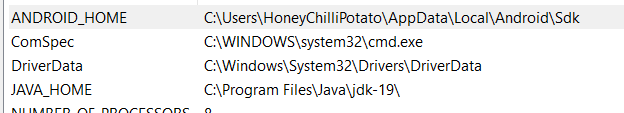

# Project Setup Guide

This guide walks you through the steps of setting up the development environment on Ubuntu, linking an Android app using Maestro, and connecting to the device using ADB.

## Prerequisites

- Ubuntu installed on your PC
- Android Studio installed
- Node.js and Yarn installed
- Java Development Kit (JDK) installed
- Git installed

## Once project is developed using the ignite boilerplate. 

## Android SDK setup
 - go to google android dev and download the latest version of the android hedhghoge and install it with all the default modules, 
 - after that, turn on your emulator, by clicking on "More Options"

## Setting up the "JAVA_HOME" and "ANDROID_HOME" Requirements 


## Ubuntu Setup

1. **Install Ubuntu:**
   - installig the wsl using wsl --install
   - then, wsl --install -d Ubuntu
   - now install wsl subsystem for the linux systems 


2. **Update and Upgrade:**
   sudo apt update
   sudo apt upgrade

3. Now, inside the ubuntu console follow these steps: 
 - Install Java
        After restarting the system, open the Terminal application and click on the dropdown to select Ubuntu. Type in the following command:
        sudo apt install openjdk-11-jdk
        3. Install Maestro
        Installing Maestro is now just a matter of running following one command.
            curl -Ls "https://get.maestro.mobile.dev" | bash
        Tada! 🎉
        You have successfully installed Maestro on your Windows machine 🙌
        Check your Maestro version using the following command:
        maestro --version

        set you up to use Android in your freshly installed WSL2
        Download the Android command line tools zip file from Android official site.
        Use the following instructions to set up Android command lines correctly in your WSL2.
        Open WSL2 terminal.
        Create a new directory in your home directory.
   
        ~ $ mkdir Android
        ~ $ cd Android ```
      Unzip the Android command line tools zip file in the android directory using this command: unzip ~<command_line_zip_filename>.zip
        In the  Android directory perform following actions.
        $ mkdir latest
        $ mv cmdline-tools/* latest/
        $ mv latest/ cmdline-tools/
        Note: Last command will probably give you a warning, but you don’t need the worry about that.
        Now add the following line to your ~/.bashrc file
        export ANDROID_HOME=$HOME/Android
        export PATH=$PATH:$ANDROID_HOME/cmdline-tools/latest/bin/:$PATH
        Save your ~/.bashrc file and exit.
        Run source ~/.bashrc to reload the bashrc file.
        Now, we will install basic Android utilities using the following commands:
        Run sdkmanager --list to check if everything is working fine.
        Run sdkmanager --install "platform-tools" to install platform tools.
        Finally, add the following into your ~/.bashrc file
        export PATH=$PATH:$ANDROID_HOME/platform-tools/:$PATH
        Save your ~/.bashrc file and exit.
        Run source ~/.bashrc to reload the bashrc file.
        To check that everything went well, do the following:
        Close and relaunch terminal
        Run adb --version and see that adb version is shown
        Since everything is installed fresh, your WSL 2 adb version should perfectly match with Windows ADB version that we noted down as part of the pre-requisites.

4. **Emulator on**
 - Fire up your Android emulator on Windows.
    Once the Android emulator is up and running, open a PowerShell prompt.
    Run this command in PowerShell
    adb -a -P 5037 nodaemon server
    This will start the adb server in the Windows host.
    Note down the IPV4 address of your Windows host PC/machine.

5. Sometimes you may get smartsockets.. error when you run adb -a -P 5037 nodaemon server command in PowerShell. In that case, you can do the following steps:
   

    Open task manager and kill all adb related processes.
    If Android Studio is open, close it and keep only emulator running.
    If you see a message saying emulator offline, ignore it.

 - Now on WSL 
  - adb kill-server
    export ADB_SERVER_SOCKET=tcp:<WINDOWS_IPV4_ADDR>:5037
    (You can find your wifi IP address in the seettin of your network by Setting->Wifi->

Click on i button beside connected wifi-> conpy the IPV4 address )
    adb devices
    You should see your connected emulator successfully now.


## You have now successfully insatlled the maestro, ubuntu, android SDK, java and setup the environment

6. After your project is built then, you can set the project by using
 - ```yarn ios``` or ```yarn android```
 - once project is connected
 - inside the ubuntu you can now write the test cases for example, if you have a folder named ```samples```
 - and it has test cases named as ```android-flow.yaml```
 - this yaml file is used to define the flow of the application
 - to set up this
 - ```maestro --host 192.168.29.17 test android-flow.yaml```
   can be used to run the test samples
   example, i'm using the default wikkipidea page
   

   

to run your own app you built you can use the ignite feature now in our app


``` maestro --host 192.168.29.17 test Login.yaml```


this will automate the complete application 
example


beside im facing tyhis error in my app


